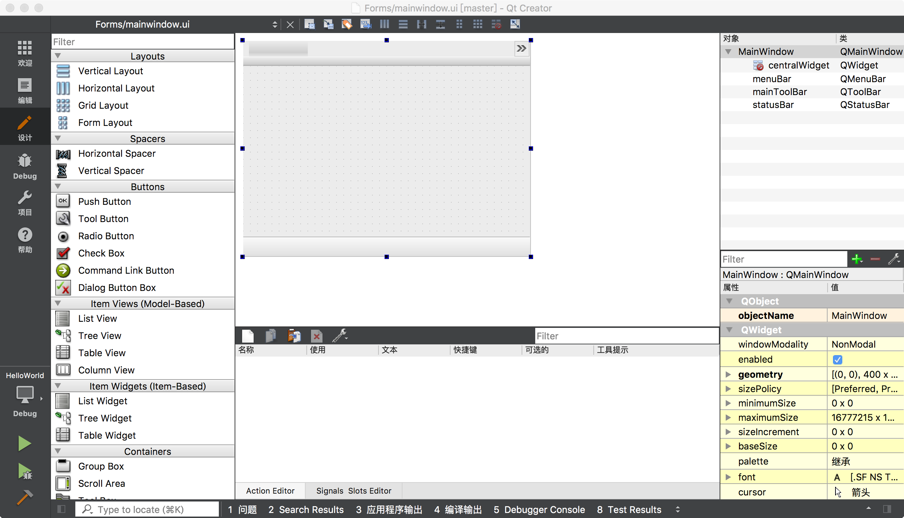

#### 编译器 CLion  
### 创建External Tools : QTDesigner  
1.打开“设置”->"External Tools"  
2.新建一个External Tools,如下：  

### 创建External Tools : UIC  
1.打开“设置”->"External Tools"  
2.新建一个External Tools,如下：  

### 总览  

### 使用  
1.在Form文件夹下新建一个文件mainwidows.ui,默认内容如下：  
```
<?xml version="1.0" encoding="UTF-8"?>
<ui version="4.0">
 <class>MainWindow</class>
 <widget class="QMainWindow" name="MainWindow">
  <property name="geometry">
   <rect>
    <x>0</x>
    <y>0</y>
    <width>400</width>
    <height>300</height>
   </rect>
  </property>
  <property name="windowTitle">
   <string>MainWindow</string>
  </property>
  <widget class="QWidget" name="centralWidget"/>
  <widget class="QMenuBar" name="menuBar">
   <property name="geometry">
    <rect>
     <x>0</x>
     <y>0</y>
     <width>400</width>
     <height>22</height>
    </rect>
   </property>
  </widget>
  <widget class="QToolBar" name="mainToolBar">
   <attribute name="toolBarArea">
    <enum>TopToolBarArea</enum>
   </attribute>
   <attribute name="toolBarBreak">
    <bool>false</bool>
   </attribute>
  </widget>
  <widget class="QStatusBar" name="statusBar"/>
 </widget>
 <layoutdefault spacing="6" margin="11"/>
 <resources/>
 <connections/>
</ui>
```
2.选择Form下的UI文件->右键->External Tools->QtDesigner,即可打开QtCreator的设计页面  
  
3.即可打开QtCreator的UI编辑页面  
  
4.即可在可视化页面下进行编辑  
5.保存可视化编辑页面之后，回到Clion,选择编辑的UI文件->右键->External Tools->UIC,即可自动生成.h文件。  
  
6.这样在程序中就可以使用这个页面了。  
  


